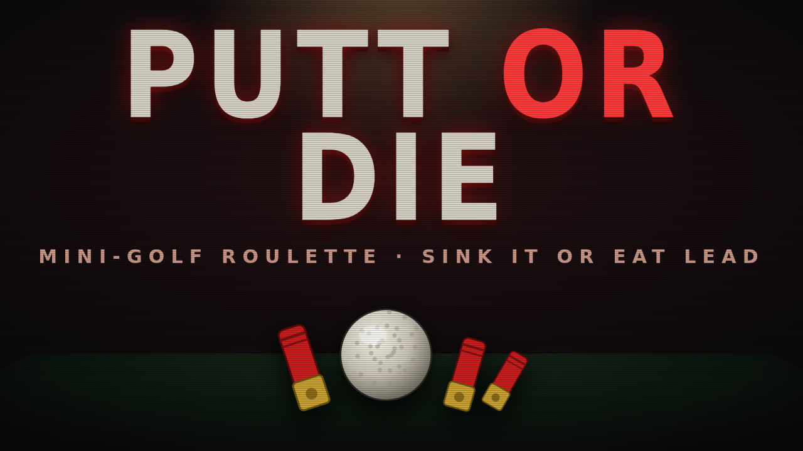

# 🩸 PUTT OR DIE

A **3D mini-golf roguelike** set in a grimy basement run by the Dealer. Sink putts,
get paid by your golf score, and descend deeper — each floor costs more to enter,
so go broke and you die. Between floors a homeless shopkeeper sells better balls.



> Hand-written WebGL (no engine, no libraries), procedural courses with real
> elevation, procedural textures, and synthesized audio — runs from one static
> folder, fully offline.

---

## How it plays

- Each hole is procedurally generated with **sloped terrain** — the ball rolls
  downhill, so read the green.
- You're paid by your **golf score** vs par: hole-in-one / eagle / birdie / par
  earn cash; **bogey, double, or a lost ball cost you money.**
- Descending to the next floor charges an **escalating fee**. Steady par stops
  covering it eventually — you need birdies or better gear. **Money below zero = you die.**
- Every couple of floors you meet **THE BASEMENT MAN**, a homeless shopkeeper
  selling better golf balls out of a sack.
- The basement is full of realistic junk — crates, steel drums, a water heater,
  bricks, paint cans, buckets, a tire — clustered naturally. Light clutter
  (cans, buckets, cardboard) **gets knocked aside** when you hit it; the heavy
  stuff bounces you. **Rats** scurry along the walls and bolt when the ball nears.
- Hazards: **water** puddles (reset + a stroke) and **dirt** patches (drag).

### Golf balls (bought from the shopkeeper)

| | Ball | Does |
|---|---|---|
| ⚪ | **Gutter Ball** | The free starter. |
| 🟡 | **Slick** | Waxed — runs far on the felt. |
| 🟠 | **Cannon** | Big power, smashes light clutter. |
| 🔵 | **Magnet** | Forgiving cup — easy sinks. |
| ⚫ | **Lead Shot** | Bulldozer; plows light junk flat. |
| 👻 | **Ghost Ball** | Better at everything. The endgame ball. |

## Controls

| Action | Keyboard | Mouse / Touch | Gamepad |
|---|---|---|---|
| Aim | `A` / `D` or `←` / `→` | drag on the course | left stick / d-pad |
| Start power & putt | `Space` / `Enter` | tap course or **PUTT** | `A` |
| Mute | `M` | 🔊 button | — |
| Restart (after death) | `R` | **BACK TO THE TABLE** | `A` |

Putting is two taps: the first starts an oscillating power meter, the second
fires. Aim around the clutter — bouncing off walls and reading the slope is the game.

## Run it locally

ES modules need to be served over HTTP (not `file://`):

```bash
python3 -m http.server 8000   # then open http://localhost:8000/
```

That's the whole game — `index.html`, `logic.js`, `strings.js`, and `js/`.
No build step, no dependencies.

## Project layout

```
index.html        the game page: canvas, HUD, CSS, bootstrap
logic.js          solo rules-module stub (required by the apps engine)
strings.js        every player-visible string (localizable)
js/
  game.js         state machine, slope physics, economy/shop, camera, HUD, juice
  course.js       procedural holes: height-field, clutter, rats, hazards
  balls.js        the shopkeeper's golf-ball upgrades
  gl.js           WebGL renderer: low-res FBO + PSX/CRT post pass; textures
  textures.js     procedural concrete / iron / cardboard / felt / wood
  audio.js        WebAudio synthesized SFX + ambient drone
  rng.js          seeded mulberry32 RNG
  math.js         mat4 / mat3 / vec helpers
media/            menu / course / shop screenshots + card art
tools/            local test + capture scripts (not shipped)
```

## Tech notes

- **Pure WebGL1**, hand-rolled. Grimy PS1/CRT look — flat faceting, warm key
  light, dark fog, posterize + dither, scanlines, chromatic aberration, film
  grain, vignette, vertex jitter — all in the shaders, plus procedural textures.
- **Elevation** is an analytic height field; the displaced green mesh and the
  ball physics read the *same* height/gradient functions, so the ball follows
  the surface exactly and rolls downhill.
- **Deterministic** ball/score sim: fixed 60 Hz timestep + seeded RNG. (Rats,
  camera shake and dust are cosmetic and may vary.)
- **Tested headless**: `tools/logic-test.mjs` checks generation, determinism and
  the analytic gradient; `tools/browser-test.mjs` drives a hole in Chromium and
  asserts a clean console.

## Hosted build

Authored for the Higgsfield game pipeline (a one-click shareable play link). The
hosted deploy isn't wired up from this environment — the workspace has no
generation credits and the asset-upload host is blocked by the network policy —
but the game is complete and self-contained, so a deploy just needs those two
things available.
